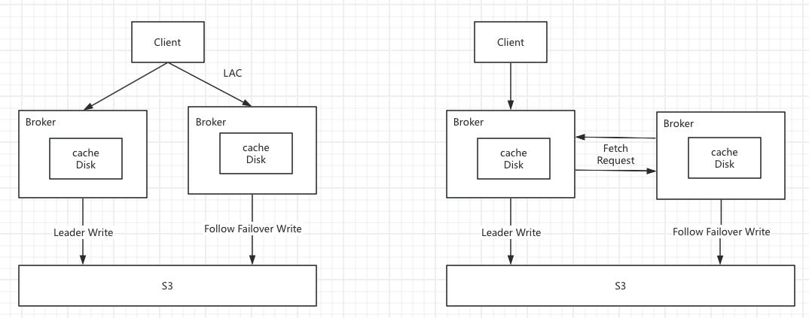

## 架构设计
设计思路：参考 BookKeeper 的客户端一致性协议，使用S3做存储\
涉及到的技术点：网络通信、序列化、

## 通信协议
通信协议是xxx，有私有协议和公共协议，公共协议是为了确定一个规范，Kafka、Pulsar都选择了私有协议，RabbitMQ实现了AMQP公有协议。
公共MQ通信协议：MQTT、AMQP、OpenMessaging
> AMQP 是主要面向业务消息的协议，因为要承载复杂的业务逻辑，所以协议设计上要尽可能丰富，包含多种场景，并且在传输过程中不允许出现数据丢失。因为 AMQP 协议本身的设计具有很多局限，比如功能太简单，所以不太符合移动互联网、云原生架构下的消息需求。\
> MQTT 是为了满足物联网领域的通信而设计的，背景是网络环境不稳定、网络带宽小，从而需要极精简的协议结构，并允许可能的数据丢失。\
> OpenMessaging 的设计初衷是设计一个符合更多场景的消息队列协议。

DemoMQ 选择了 [OpenMessaging](https://github.com/openmessaging/)

## 网络模块
MQ的网络模块，需要实现高性能，TCP长连接的方式。\
Kafka 基于 Reactor 模型，使用 Java NIO 自己实现了网络层。\
Pulsar 使用了 NIO 框架 netty 做网络层，使用 protobuf 实现编解码。\
RocketMQ 5.0 的 Proxy 使用了 RPC 框架：gRPC 实现网路层。

基于框架可以节省很多开发成本，因此 DemoMQ 选择了 [gRPC](https://grpc.io/docs/languages/java/quickstart/) 的方案

## 一致性协议

## 对象存储

